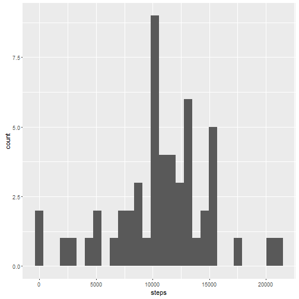
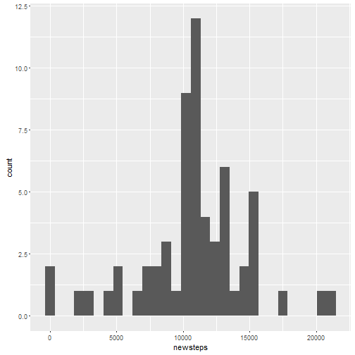
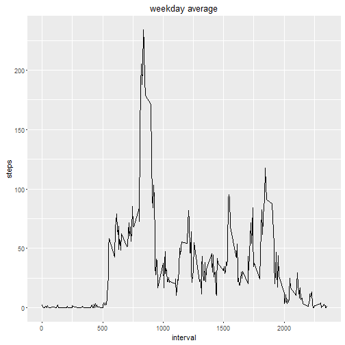
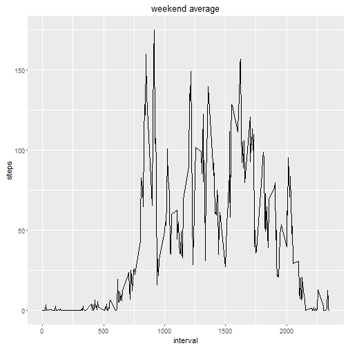

Course 5 Week 2 assignment
================


prepare required library

```r
library(ggplot2)
library(dplyr)
```

```
## Warning: package 'dplyr' was built under R version 3.2.5
```

```
## 
## Attaching package: 'dplyr'
```

```
## The following objects are masked from 'package:stats':
## 
##     filter, lag
```

```
## The following objects are masked from 'package:base':
## 
##     intersect, setdiff, setequal, union
```

```r
library(tidyr)
```

```
## Warning: package 'tidyr' was built under R version 3.2.5
```

```r
library(knitr)
```
Loading and preprocessing the data
Show any code that is needed to
Load the data (i.e. read.csv())
Process/transform the data (if necessary) into a format suitable for your analysis

```r
data <- read.csv("activity.csv", colClasses = c("integer","Date","integer"))
data1 <- subset(data,!is.na(steps))
```

What is mean total number of steps taken per day?
For this part of the assignment, you can ignore the missing values in the dataset.
Calculate the total number of steps taken per day

```r
steps <- tapply(data1$steps, data1$date, sum, na.rm=TRUE)
print(steps)
```

```
## 2012-10-02 2012-10-03 2012-10-04 2012-10-05 2012-10-06 2012-10-07 
##        126      11352      12116      13294      15420      11015 
## 2012-10-09 2012-10-10 2012-10-11 2012-10-12 2012-10-13 2012-10-14 
##      12811       9900      10304      17382      12426      15098 
## 2012-10-15 2012-10-16 2012-10-17 2012-10-18 2012-10-19 2012-10-20 
##      10139      15084      13452      10056      11829      10395 
## 2012-10-21 2012-10-22 2012-10-23 2012-10-24 2012-10-25 2012-10-26 
##       8821      13460       8918       8355       2492       6778 
## 2012-10-27 2012-10-28 2012-10-29 2012-10-30 2012-10-31 2012-11-02 
##      10119      11458       5018       9819      15414      10600 
## 2012-11-03 2012-11-05 2012-11-06 2012-11-07 2012-11-08 2012-11-11 
##      10571      10439       8334      12883       3219      12608 
## 2012-11-12 2012-11-13 2012-11-15 2012-11-16 2012-11-17 2012-11-18 
##      10765       7336         41       5441      14339      15110 
## 2012-11-19 2012-11-20 2012-11-21 2012-11-22 2012-11-23 2012-11-24 
##       8841       4472      12787      20427      21194      14478 
## 2012-11-25 2012-11-26 2012-11-27 2012-11-28 2012-11-29 
##      11834      11162      13646      10183       7047
```

If you do not understand the difference between a histogram and a barplot, research the difference between them. Make a histogram of the total number of steps taken each day

```r
qplot(steps)
```

```
## `stat_bin()` using `bins = 30`. Pick better value with `binwidth`.
```



Calculate and report the mean and median of the total number of steps taken per day

```r
mean(steps)
```

```
## [1] 10766.19
```

```r
median(steps)
```

```
## [1] 10765
```
What is the average daily activity pattern?

Make a time series plot (i.e. type = "l") of the 5-minute interval (x-axis) and the average number of steps taken, averaged across all days (y-axis)

```r
dayavg <- aggregate(steps~interval,data = data1, FUN=mean)
ggplot(data = dayavg, aes(x=interval, y=steps))+geom_line()
```


Which 5-minute interval, on average across all the days in the dataset, contains the maximum number of steps?

```r
dayavg[which.max(dayavg$steps), ]
```

```
##     interval    steps
## 104      835 206.1698
```
Imputing missing values

Note that there are a number of days/intervals where there are missing values (coded as NA). The presence of missing days may introduce bias into some calculations or summaries of the data.

Calculate and report the total number of missing values in the dataset (i.e. the total number of rows with NAs)

```r
nrow(subset(data,is.na(steps)))
```

```
## [1] 2304
```
Devise a strategy for filling in all of the missing values in the dataset. The strategy does not need to be sophisticated. For example, you could use the mean/median for that day, or the mean for that 5-minute interval, etc.
Create a new dataset that is equal to the original dataset but with the missing data filled in.

```r
newdata <- data
newdata[is.na(newdata$steps),]$steps <- mean(newdata$steps, na.rm=TRUE)
```

Make a histogram of the total number of steps taken each day and Calculate and report the mean and median total number of steps taken per day. Do these values differ from the estimates from the first part of the assignment? What is the impact of imputing missing data on the estimates of the total daily number of steps?

```r
newsteps <- tapply(newdata$steps, newdata$date, sum, na.rm=TRUE)
qplot(newsteps)
```

```
## `stat_bin()` using `bins = 30`. Pick better value with `binwidth`.
```



```r
mean(newsteps)
```

```
## [1] 10766.19
```

```r
median(newsteps)
```

```
## [1] 10766.19
```

Are there differences in activity patterns between weekdays and weekends?
Create a new factor variable in the dataset with two levels – “weekday” and “weekend” indicating whether a given date is a weekday or weekend day.

```r
data2 <- data
weekdays1 <- c('Monday', 'Tuesday', 'Wednesday', 'Thursday', 'Friday')
data2 <- mutate(data, isweekday = weekdays(date)) 
data2$isweekday <- factor(data2$isweekday %in% weekdays1, levels=c(FALSE, TRUE), labels=c('weekend', 'weekday') )
```

Make a panel plot containing a time series plot (i.e. type = "l") of the 5-minute interval (x-axis) and the average number of steps taken, averaged across all weekday days or weekend days (y-axis). See the README file in the GitHub repository to see an example of what this plot should look like using simulated data.

```r
weekdayavg <- aggregate(steps~interval,data = subset(data2, isweekday=="weekday"), FUN=mean)
weekendavg <- aggregate(steps~interval,data = subset(data2,isweekday=="weekend"), FUN=mean)

ggplot(data = weekdayavg, aes(x=interval, y=steps))+geom_line()+labs(title = "weekday average")
```



```r
ggplot(data = weekendavg, aes(x=interval, y=steps))+geom_line()+labs(title = "weekend average")
```




